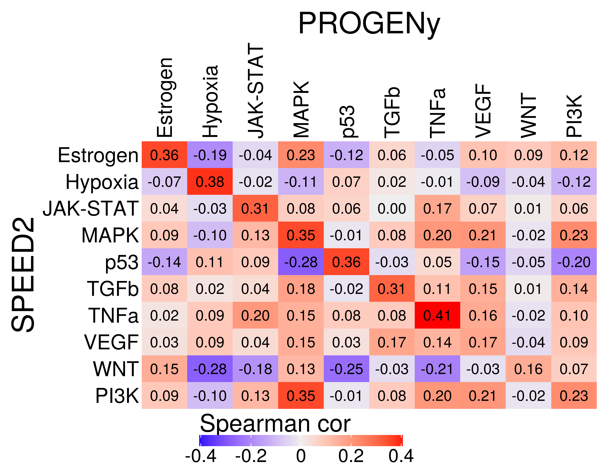
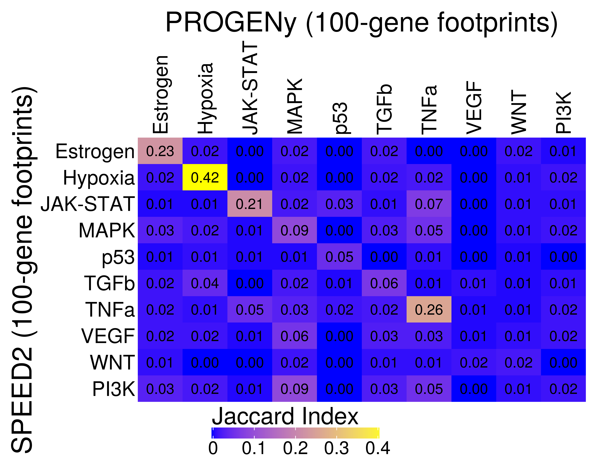

Signature comparison between PROGENy and SPEED2
================
Javier Perales-Patón - <javier.perales@bioquant.uni-heidelberg.de>

Recently, [SPEED2](https://github.com/molsysbio/speed2) was released
upon the manuscript publication in
NAR[ref](https://doi.org/10.1093/nar/gkaa236). They have increased
pathway coverage by mining an increased number of datasets. The full
database could be accessed at a TSV file in the repository (
[`speed2_experiments.tsv`](https://github.com/molsysbio/speed2/blob/master/data-raw/speed2_experiments.tsv)
). After further investigation of their repository, it seems that they
provide a database with the signatures under a RData file at
[`R/sysdata.rda`](https://github.com/molsysbio/speed2/blob/master/R/sysdata.rda).

## Setup environment

The environment will be set with a random seed number for
reproducibility and an output folder for processed data and figures.

### set env

``` r
options(stringsAsFactors = FALSE)
# Seed number
set.seed(1234)
# Output directory
OUTDIR <- "./match_output/"
if(!dir.exists(OUTDIR)) dir.create(OUTDIR);

# Figures
FIGDIR <- paste0(OUTDIR, "/figures/")
knitr::opts_chunk$set(fig.path=FIGDIR)
knitr::opts_chunk$set(dev=c('png'))
# Data
DATADIR <- paste0(OUTDIR, "/data/")
if(!dir.exists(DATADIR)) dir.create(DATADIR);
```

### Load libraries

Essential libraries for R analysis.

``` r
library(fgsea)
library(progeny)
library(ComplexHeatmap)
```

Register vars from env

``` r
env_var <- ls()
```

## Data

### PROGENy signatures

We are going to use the full matrix of weights from PROGENy. For this,
we use the native function to get the matrix of weights

``` r
progeny_model <- progeny::getModel("Human", top=Inf)
dim(progeny_model)
```

    ## [1] 22479    14

For the records, we show the pathway names

``` r
print(colnames(progeny_model))
```

    ##  [1] "Androgen" "EGFR"     "Estrogen" "Hypoxia"  "JAK-STAT" "MAPK"    
    ##  [7] "NFkB"     "p53"      "PI3K"     "TGFb"     "TNFa"     "Trail"   
    ## [13] "VEGF"     "WNT"

### SPEED2 signatures

Download the database of SPEED2 signatures if needed.

``` r
fl <- "https://github.com/molsysbio/speed2/raw/master/R/sysdata.rda"
speed2_fl <- paste0(DATADIR,"/",basename(fl))
if(!file.exists(speed2_fl)) {
    download.file(url=fl, destfile=speed2_fl)
}
```

Load SPEED2 data

``` r
load(speed2_fl)
```

Which objects contains that rda file?

``` r
setdiff(ls(), env_var)
```

    ## character(0)

Taking into account that PROGENy data is just a matrix of gene symbols X
pathways. We are interested just in three files to make easy the
matching with PROGENy:

  - `speed2_signatures` contains the signatures as a long data.frame.
  - `speed2_pathways` contains pathway IDs to pathway names.
  - `df_entrezID` points out hgnc gene symbols to entrezID.

For the records, we show the pathway names from SPEED2:

``` r
print(speed2_pathways$p_id)
```

    ##  [1] "Estrogen"  "H2O2"      "Hippo"     "Hypoxia"   "IL-1"      "Insulin"  
    ##  [7] "JAK-STAT"  "MAPK+PI3K" "TLR"       "Notch"     "p53"       "PPAR"     
    ## [13] "TGFb"      "TNFa"      "VEGF"      "Wnt"

We will create a PROGENy-like matrix for further comparisons. For this
we have to reformat the data.

``` r
# speed2_signatures2 <- merge(x=speed2_signatures, y=speed2_pathways,
#               by.x="pathway_number", by.y="pathway_number",
#               all.x=TRUE)
# speed2_signatures3 <- merge(x=speed2_signatures2, y=df_entrezID,
#               by.x="g_id", by.y="g_id", all.x=TRUE)
```

Just to explore the database: it seems that not all gene universe is
equally represented along the 16 pathways. Probably they have
pre-selected genes based on subsets of the experiment database to build
the model.

``` r
(speed2_path_cnt <- length(unique(speed2_signatures$pathway_number)))
```

    ## [1] 16

``` r
(speed2_gene_universe <- length(unique(speed2_signatures$g_id)))
```

    ## [1] 24501

``` r
# All gene universe is represented along the 16 pathways?
hist(table(speed2_signatures$g_id))
```

<!-- -->

We build a PROGENy-like matrix for further comparisons.

``` r
# First we define a dictionary of pathways
pathway_n2id <- setNames(speed2_pathways$p_id, 
             as.character(speed2_pathways$pathway_number))
# Second we define the universe of genes
## If there is any duplicated, we are going to select the first entry in numerical entry
## because that means it was the first recorded with that name.
if(any(duplicated(df_entrezID$gene))) {
 cat("WARN: Selecting genes based on order for duplicated genes\n",
     file=stdout())
 df_entrezID <- df_entrezID[order(df_entrezID$g_id, decreasing=FALSE),]
 df_entrezID <- df_entrezID[!duplicated(df_entrezID$gene),]
 
 speed2_signatures <- speed2_signatures[speed2_signatures$g_id %in% df_entrezID$g_id, ]
}
```

    ## WARN: Selecting genes based on order for duplicated genes

``` r
# Finally, we define the gene universe
genes_entrez2hgnc <- setNames(df_entrezID$gene, 
                  as.character(df_entrezID$g_id))
# Speed2 weights: we define weights as -log10(pval) * sign(zscore)
speed2_signatures$weight <- -log10(speed2_signatures$qval) *
    sign(speed2_signatures$zrank_signed_mean)

# Empty matrix to store the model
SPEED2_model <- matrix(NA, nrow=length(genes_entrez2hgnc), ncol=length(pathway_n2id),
               dimnames=list(genes_entrez2hgnc, pathway_n2id))
# We split by chunks of pathways the signatures
speed2_signatures2 <- split(speed2_signatures, speed2_signatures$pathway_number)

for(pid in names(speed2_signatures2)) {
    signat <- speed2_signatures2[[pid]]$weight
    names(signat) <- genes_entrez2hgnc[as.character(speed2_signatures2[[pid]]$g_id)]
    if(any(is.na(names(signat)))) {
        cat(paste0("WARN: it seems there are NA's in gene symbols from signatures...",
               "n=",sum(is.na(names(signat))),".\n",
               "Those will be removed.\n"),
            file=stdout())
        signat <- signat[!is.na(names(signat))] # I found one case of 1 entrezID not described 
    }

    #Dimension
    genes <- names(signat) 
    path <- pathway_n2id[as.character(pid)]
    # Replace
    SPEED2_model[genes, path] <- signat 
}
```

## Looking for a common space

First we take a look which pathways are common between the two methods.
We will rename them to match each other. In summary:

  - Estrogen, Hypoxia, JAK-STAT, p53, TGFb, TNFa, VEGF.
  - Both present Wnt, but one is uppercase - we will change it
    accordingly.
  - `PROGENy` presents two separates, MAPK and PI3K, while those are
    jointly built in `SPEED2`.

<!-- end list -->

``` r
colnames(SPEED2_model)
```

    ##           1           2           3           4           5           6 
    ##  "Estrogen"      "H2O2"     "Hippo"   "Hypoxia"      "IL-1"   "Insulin" 
    ##           7           8           9          10          11          12 
    ##  "JAK-STAT" "MAPK+PI3K"       "TLR"     "Notch"       "p53"      "PPAR" 
    ##          13          14          15          16 
    ##      "TGFb"      "TNFa"      "VEGF"       "Wnt"

``` r
colnames(progeny_model)
```

    ##  [1] "Androgen" "EGFR"     "Estrogen" "Hypoxia"  "JAK-STAT" "MAPK"    
    ##  [7] "NFkB"     "p53"      "PI3K"     "TGFb"     "TNFa"     "Trail"   
    ## [13] "VEGF"     "WNT"

We reformat `pathways` accordingly: WNT is uppercased, SPEED2’s
MAPK+PI3K is duplicated and renamed for further comparison.

``` r
# Uppercase Wnt
colnames(SPEED2_model)[which(colnames(SPEED2_model)=="Wnt")] <- "WNT"

# Split and rename double MAPK+PI3K
SPEED2_model <- cbind(SPEED2_model, "PI3K"=SPEED2_model[,"MAPK+PI3K"])
colnames(SPEED2_model)[which(colnames(SPEED2_model)=="MAPK+PI3K")] <- "MAPK"
# Get common pathways
(common_paths <- intersect(colnames(SPEED2_model), colnames(progeny_model)))
```

    ##  [1] "Estrogen" "Hypoxia"  "JAK-STAT" "MAPK"     "p53"      "TGFb"    
    ##  [7] "TNFa"     "VEGF"     "WNT"      "PI3K"

What about the genes? Well, actually there is a large overlap\! 21k
genes. However, many of these present NA’s.

``` r
nrow(SPEED2_model)
```

    ## [1] 29191

``` r
nrow(progeny_model)
```

    ## [1] 22479

``` r
length(intersect(rownames(SPEED2_model),rownames(progeny_model)))
```

    ## [1] 20976

``` r
# How many NA's per pathway
barplot(colSums(is.na(SPEED2_model)), horiz = TRUE, las=1)
```

<!-- -->

``` r
# get common genes
common_genes <- intersect(rownames(SPEED2_model), rownames(progeny_model))
```

## Signature comparison

First we subset the data to have common dimension

``` r
S2 <- SPEED2_model[common_genes, common_paths]
P <- progeny_model[common_genes, common_paths]
```

Pearson correlation shows a strong positive correlation between matched
pairs between both models. With the exception of WNT and VGF pathways.

``` r
cormat <- cor(S2, P, method="pearson", use="pairwise.complete.obs")

corhp <- Heatmap(cormat, name="Pearson cor", 
    cluster_rows = FALSE, cluster_columns = FALSE,
    row_title = "SPEED2", column_title="PROGENy",
    row_names_side = "left", column_names_side="top",
    row_names_gp = gpar(fontsize=22), column_names_gp = gpar(fontsize=22),
    row_title_gp = gpar(fontsize=32), column_title_gp = gpar(fontsize=32),
    heatmap_legend_param = list("legend_direction"="horizontal",
                    "labels_gp"=gpar(fontsize=20),
                    "title_gp"=gpar(fontsize=26)
                    ),
    cell_fun = function(j, i, x, y, w, h, col) { # add text to each grid
        grid.text(sprintf("%.2f",cormat[i, j]), x, y, gp = gpar(fontsize=16))
    })
draw(corhp, heatmap_legend_side="bottom")
```

<!-- -->

``` r
cormat <- cor(S2, P, method="spearman", use="pairwise.complete.obs")

corhp <- Heatmap(cormat, name="Spearman cor", 
    cluster_rows = FALSE, cluster_columns = FALSE,
    row_title = "SPEED2", column_title="PROGENy",
    row_names_side = "left", column_names_side="top",
    row_names_gp = gpar(fontsize=22), column_names_gp = gpar(fontsize=22),
    row_title_gp = gpar(fontsize=32), column_title_gp = gpar(fontsize=32),
    heatmap_legend_param = list("legend_direction"="horizontal",
                    "labels_gp"=gpar(fontsize=20),
                    "title_gp"=gpar(fontsize=26)
                    ),
    cell_fun = function(j, i, x, y, w, h, col) { # add text to each grid
        grid.text(sprintf("%.2f",cormat[i, j]), x, y, gp = gpar(fontsize=16))
    })
draw(corhp, heatmap_legend_side="bottom")
```

<!-- -->

``` r
jaccard_idx <- function(A, B) {
    idx <- length(intersect(A,B)) / length(unique(c(A,B)))
    return(idx)
}

S2_foot <- sapply(colnames(S2), function(pid) {
              rnk <- S2[,pid]
              names(rnk) <- paste0(rownames(S2),
                           ifelse(sign(rnk)>0,"_POS","_NEG")
                           )
              rnk <- sort(abs(na.omit(rnk)),decreasing=TRUE)
              return(head(names(rnk),100))
    }, simplify=FALSE)

P_foot <- sapply(colnames(P), function(pid) {
              rnk <- P[,pid]
              names(rnk) <- paste0(rownames(S2),
                           ifelse(sign(rnk)>0,"_POS","_NEG")
                           )
              rnk <- sort(abs(na.omit(rnk)),decreasing=TRUE)
              return(head(names(rnk),100))
    }, simplify=FALSE)


jacmat <- matrix(NA, nrow=ncol(S2), ncol=ncol(P), 
          dimnames=list(colnames(S2), colnames(P)))
for(ridx in rownames(jacmat)) {
    A <- S2_foot[[ridx]]
    for(cidx in colnames(jacmat)) {
        B <- P_foot[[cidx]]
        jacmat[ridx, cidx] <- jaccard_idx(A,B)
    }
}

jachp <- Heatmap(jacmat, name="Jaccard Index",col=c("blue","yellow"), 
    cluster_rows = FALSE, cluster_columns = FALSE,
    row_title = "SPEED2 (100-gene footprints)", 
    column_title="PROGENy (100-gene footprints)",
    row_names_side = "left", column_names_side="top",
    row_names_gp = gpar(fontsize=22), column_names_gp = gpar(fontsize=22),
    row_title_gp = gpar(fontsize=30), column_title_gp = gpar(fontsize=30),
    heatmap_legend_param = list("legend_direction"="horizontal",
                    "labels_gp"=gpar(fontsize=20),
                    "title_gp"=gpar(fontsize=26)
                    ),
    cell_fun = function(j, i, x, y, w, h, col) { # add text to each grid
        grid.text(sprintf("%.2f",jacmat[i, j]), x, y, gp = gpar(fontsize=16))
    })
draw(jachp, heatmap_legend_side="bottom")
```

<!-- -->

## Session info

``` r
sessionInfo()
```

    ## R version 4.0.0 (2020-04-24)
    ## Platform: x86_64-conda_cos6-linux-gnu (64-bit)
    ## Running under: Ubuntu 18.04.3 LTS
    ## 
    ## Matrix products: default
    ## BLAS/LAPACK: /home/jperales/miniconda3/envs/SPEED2vPROGENy/lib/libopenblasp-r0.3.9.so
    ## 
    ## locale:
    ##  [1] LC_CTYPE=en_US.UTF-8       LC_NUMERIC=C              
    ##  [3] LC_TIME=en_GB.UTF-8        LC_COLLATE=en_US.UTF-8    
    ##  [5] LC_MONETARY=en_GB.UTF-8    LC_MESSAGES=en_US.UTF-8   
    ##  [7] LC_PAPER=en_GB.UTF-8       LC_NAME=C                 
    ##  [9] LC_ADDRESS=C               LC_TELEPHONE=C            
    ## [11] LC_MEASUREMENT=en_GB.UTF-8 LC_IDENTIFICATION=C       
    ## 
    ## attached base packages:
    ## [1] grid      stats     graphics  grDevices utils     datasets  methods  
    ## [8] base     
    ## 
    ## other attached packages:
    ## [1] ComplexHeatmap_2.4.2 progeny_1.10.0       fgsea_1.14.0        
    ## [4] rmarkdown_2.1        nvimcom_0.9-82      
    ## 
    ## loaded via a namespace (and not attached):
    ##  [1] circlize_0.4.9      shape_1.4.4         GetoptLong_0.1.8   
    ##  [4] tidyselect_1.1.0    xfun_0.13           purrr_0.3.4        
    ##  [7] lattice_0.20-41     colorspace_1.4-1    vctrs_0.3.0        
    ## [10] htmltools_0.4.0     yaml_2.2.1          utf8_1.1.4         
    ## [13] rlang_0.4.6         pillar_1.4.4        glue_1.4.1         
    ## [16] BiocParallel_1.22.0 RColorBrewer_1.1-2  lifecycle_0.2.0    
    ## [19] stringr_1.4.0       munsell_0.5.0       gtable_0.3.0       
    ## [22] GlobalOptions_0.1.1 evaluate_0.14       knitr_1.28         
    ## [25] parallel_4.0.0      fansi_0.4.1         Rcpp_1.0.4.6       
    ## [28] scales_1.1.1        gridExtra_2.3       fastmatch_1.1-0    
    ## [31] rjson_0.2.20        ggplot2_3.3.0       png_0.1-7          
    ## [34] digest_0.6.25       stringi_1.4.6       dplyr_0.8.5        
    ## [37] ggrepel_0.8.2       clue_0.3-57         cli_2.0.2          
    ## [40] tools_4.0.0         magrittr_1.5        tibble_3.0.1       
    ## [43] cluster_2.1.0       crayon_1.3.4        tidyr_1.0.3        
    ## [46] pkgconfig_2.0.3     ellipsis_0.3.1      Matrix_1.2-18      
    ## [49] data.table_1.12.8   assertthat_0.2.1    R6_2.4.1           
    ## [52] compiler_4.0.0

``` r
{                                                                                                                                                                                                           
sink(file=paste0(OUTDIR,"/sessionInfo.txt"))
print(sessionInfo())
sink()
}
```
